Ejercicio de módulo
================
Jeshua Zyanya Bejarano García
2024-10-09

``` r
library(openxlsx)
library(tidyverse)
```

    ## ── Attaching core tidyverse packages ──────────────────────── tidyverse 2.0.0 ──
    ## ✔ dplyr     1.1.4     ✔ readr     2.1.5
    ## ✔ forcats   1.0.0     ✔ stringr   1.5.1
    ## ✔ ggplot2   3.5.1     ✔ tibble    3.2.1
    ## ✔ lubridate 1.9.3     ✔ tidyr     1.3.1
    ## ✔ purrr     1.0.2     
    ## ── Conflicts ────────────────────────────────────────── tidyverse_conflicts() ──
    ## ✖ dplyr::filter() masks stats::filter()
    ## ✖ dplyr::lag()    masks stats::lag()
    ## ℹ Use the conflicted package (<http://conflicted.r-lib.org/>) to force all conflicts to become errors

``` r
library(cluster)
library(devtools)
```

    ## Cargando paquete requerido: usethis

``` r
library(factoextra)
```

    ## Welcome! Want to learn more? See two factoextra-related books at https://goo.gl/ve3WBa

``` r
library(gridExtra)
```

    ## 
    ## Adjuntando el paquete: 'gridExtra'
    ## 
    ## The following object is masked from 'package:dplyr':
    ## 
    ##     combine

``` r
library(NbClust)
```

``` r
indicadores <- read.xlsx( "BOL_BP_MAY_ 2017.xlsx",colNames=T, startRow = 8, rows=c(8,15,33,54,59,88), sheet="INDICADORES" )[-1]; head(indicadores)
```

    ##                                 NOMBRE.DEL.INDICADOR BP.GUAYAQUIL BP.PACIFICO
    ## 1                ACTIVOS PRODUCTIVOS / TOTAL ACTIVOS   0.81541724  0.78659640
    ## 2                      MOROSIDAD DE LA CARTERA TOTAL   0.03064943  0.03755224
    ## 3           GASTOS DE OPERACION  / MARGEN FINANCIERO   0.78362021  0.82929987
    ## 4         RESULTADOS DEL EJERCICIO / ACTIVO PROMEDIO   0.01070861  0.01033806
    ## 5 FONDOS DISPONIBLES / TOTAL DEPOSITOS A CORTO PLAZO   0.34377067  0.31105061
    ##   BP.PICHINCHA BP.PRODUBANCO BANCOS.PRIVADOS.GRANDES   BP.AUSTRO BP.BOLIVARIANO
    ## 1  0.851998807   0.838457200              0.82925539 0.809853560    0.798151287
    ## 2  0.041028468   0.024946927              0.03601576 0.061813095    0.013080900
    ## 3  0.922436137   0.895376828              0.87325284 0.969650675    0.801078126
    ## 4  0.009629834   0.006401269              0.00941218 0.002343685    0.007326165
    ## 5  0.201239348   0.239003176              0.25294884 0.274503555    0.364377806
    ##    BP.CITIBANK BP.GENERAL.RUMIÑAHUI BP.INTERNACIONAL    BP.LOJA  BP.MACHALA
    ## 1 0.8644133355           0.92683461       0.87208447 0.81470406 0.798389760
    ## 2 0.0009472339           0.02402669       0.01660947 0.05843954 0.042589419
    ## 3 0.6941305736           0.77009914       0.66859290 0.71565140 0.946838701
    ## 4 0.0180021991           0.01332103       0.01091718 0.01376022 0.002597089
    ## 5 0.3425838482           0.34704696       0.23103273 0.40474658 0.302391257
    ##   BP.SOLIDARIO BP.PROCREDIT BANCOS.PRIVADOS.MEDIANOS BP.AMAZONAS
    ## 1   0.93961882 0.8410417108              0.843074182 0.854846891
    ## 2   0.06470354 0.0425556359              0.030156998 0.074538865
    ## 3   0.85785359 1.4195301663              0.807668230 1.051161963
    ## 4   0.01034940 0.0001252713              0.008390013 0.002424085
    ## 5   0.35404403 0.2586206224              0.302274033 0.236225361
    ##   BP.COMERCIAL.DE.MANABI BP.LITORAL BP.COOPNACIONAL  BP.CAPITAL    BP.FINCA
    ## 1           0.7126343766  0.8264850     0.952220391  0.72665221 0.915507384
    ## 2           0.0940461413  0.1246920     0.003567011  0.29902254 0.044188059
    ## 3           0.9536344657  1.3693360     0.729240392  3.07877252 1.242337041
    ## 4           0.0008679793 -0.0174591     0.009959174 -0.02343208 0.008558966
    ## 5           0.2362357857  0.2124923     0.269343173  0.27318239 0.192041775
    ##    BP.DELBANK BP.D-MIRO.S.A. BP.BANCODESARROLLO BP.VISIONFUND.ECUADOR
    ## 1 0.803670169    0.914215393       0.8957865088            0.96989791
    ## 2 0.127915218    0.158303052       0.0775399263            0.04334920
    ## 3 1.007846590    1.225549931       1.1894810881            0.82014334
    ## 4 0.006142088    0.003024918       0.0006318423            0.02666783
    ## 5 0.589730665    0.507054335       0.3324563528            1.34897743
    ##   BANCOS.PRIVADOS.PEQUEÑOS TOTAL.BANCOS.PRIVADOS BANCOS.PRIVADOS.COMERCIALES
    ## 1              0.874786975           0.834840789                 0.838830922
    ## 2              0.105199369           0.035948609                 0.031329202
    ## 3              1.103544185           0.860108844                 0.853605291
    ## 4              0.001968583           0.008898606                 0.009108897
    ## 5              0.285764741           0.269801725                 0.259615962
    ##   BANCOS.PRIVADOS.CONSUMO BANCOS.PRIVADOS.VIVIENDA
    ## 1             0.805716464                       NA
    ## 2             0.044933681                        0
    ## 3             0.867445487                       NA
    ## 4             0.008219284                       NA
    ## 5             0.303742277                       NA
    ##   BANCOS.PRIVADOS.DE.MICROEMPRESA
    ## 1                     0.933305641
    ## 2                     0.072401560
    ## 3                     0.923132389
    ## 4                     0.008814753
    ## 5                     0.327990657

Convertimos la tabla a un formato largo.

``` r
indicadores %>% select(-BANCOS.PRIVADOS.VIVIENDA) %>% 
  pivot_longer(!NOMBRE.DEL.INDICADOR,names_to="Bancos",values_to="n") %>% 
  pivot_wider(names_from=NOMBRE.DEL.INDICADOR,values_from=n) %>% 
  as.data.frame() -> indicadores; head(indicadores)
```

    ##                    Bancos ACTIVOS PRODUCTIVOS / TOTAL ACTIVOS
    ## 1            BP.GUAYAQUIL                           0.8154172
    ## 2             BP.PACIFICO                           0.7865964
    ## 3            BP.PICHINCHA                           0.8519988
    ## 4           BP.PRODUBANCO                           0.8384572
    ## 5 BANCOS.PRIVADOS.GRANDES                           0.8292554
    ## 6               BP.AUSTRO                           0.8098536
    ##   MOROSIDAD DE LA CARTERA TOTAL GASTOS DE OPERACION  / MARGEN FINANCIERO
    ## 1                    0.03064943                                0.7836202
    ## 2                    0.03755224                                0.8292999
    ## 3                    0.04102847                                0.9224361
    ## 4                    0.02494693                                0.8953768
    ## 5                    0.03601576                                0.8732528
    ## 6                    0.06181310                                0.9696507
    ##   RESULTADOS DEL EJERCICIO / ACTIVO PROMEDIO
    ## 1                                0.010708608
    ## 2                                0.010338061
    ## 3                                0.009629834
    ## 4                                0.006401269
    ## 5                                0.009412180
    ## 6                                0.002343685
    ##   FONDOS DISPONIBLES / TOTAL DEPOSITOS A CORTO PLAZO
    ## 1                                          0.3437707
    ## 2                                          0.3110506
    ## 3                                          0.2012393
    ## 4                                          0.2390032
    ## 5                                          0.2529488
    ## 6                                          0.2745036

Asignamos los nombres de las filas a nuestro data frame.

``` r
names <- indicadores[1]
indicadores <- indicadores[-1]
row.names(indicadores) <- names[,1]; head(indicadores)
```

    ##                         ACTIVOS PRODUCTIVOS / TOTAL ACTIVOS
    ## BP.GUAYAQUIL                                      0.8154172
    ## BP.PACIFICO                                       0.7865964
    ## BP.PICHINCHA                                      0.8519988
    ## BP.PRODUBANCO                                     0.8384572
    ## BANCOS.PRIVADOS.GRANDES                           0.8292554
    ## BP.AUSTRO                                         0.8098536
    ##                         MOROSIDAD DE LA CARTERA TOTAL
    ## BP.GUAYAQUIL                               0.03064943
    ## BP.PACIFICO                                0.03755224
    ## BP.PICHINCHA                               0.04102847
    ## BP.PRODUBANCO                              0.02494693
    ## BANCOS.PRIVADOS.GRANDES                    0.03601576
    ## BP.AUSTRO                                  0.06181310
    ##                         GASTOS DE OPERACION  / MARGEN FINANCIERO
    ## BP.GUAYAQUIL                                           0.7836202
    ## BP.PACIFICO                                            0.8292999
    ## BP.PICHINCHA                                           0.9224361
    ## BP.PRODUBANCO                                          0.8953768
    ## BANCOS.PRIVADOS.GRANDES                                0.8732528
    ## BP.AUSTRO                                              0.9696507
    ##                         RESULTADOS DEL EJERCICIO / ACTIVO PROMEDIO
    ## BP.GUAYAQUIL                                           0.010708608
    ## BP.PACIFICO                                            0.010338061
    ## BP.PICHINCHA                                           0.009629834
    ## BP.PRODUBANCO                                          0.006401269
    ## BANCOS.PRIVADOS.GRANDES                                0.009412180
    ## BP.AUSTRO                                              0.002343685
    ##                         FONDOS DISPONIBLES / TOTAL DEPOSITOS A CORTO PLAZO
    ## BP.GUAYAQUIL                                                     0.3437707
    ## BP.PACIFICO                                                      0.3110506
    ## BP.PICHINCHA                                                     0.2012393
    ## BP.PRODUBANCO                                                    0.2390032
    ## BANCOS.PRIVADOS.GRANDES                                          0.2529488
    ## BP.AUSTRO                                                        0.2745036

# Cluster jerarquico.

Usaremos una distancia euclidiana bajo el método de separación Ward.D

``` r
cluster <- hclust(dist(indicadores, method = "euclidean"),
                  method = "ward.D")
plot(cluster,hang = -0.01,cex=0.8)
```

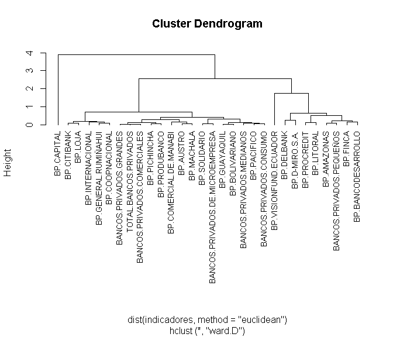<!-- -->
Notamos la clara construcción de cinco grupos. Sostenemos que seis
grupos son suficientes para clasificar.

``` r
cutree(cluster,k=6)
```

    ##                    BP.GUAYAQUIL                     BP.PACIFICO 
    ##                               1                               1 
    ##                    BP.PICHINCHA                   BP.PRODUBANCO 
    ##                               1                               1 
    ##         BANCOS.PRIVADOS.GRANDES                       BP.AUSTRO 
    ##                               1                               1 
    ##                  BP.BOLIVARIANO                     BP.CITIBANK 
    ##                               1                               2 
    ##            BP.GENERAL.RUMIÑAHUI                BP.INTERNACIONAL 
    ##                               2                               2 
    ##                         BP.LOJA                      BP.MACHALA 
    ##                               2                               1 
    ##                    BP.SOLIDARIO                    BP.PROCREDIT 
    ##                               1                               3 
    ##        BANCOS.PRIVADOS.MEDIANOS                     BP.AMAZONAS 
    ##                               1                               3 
    ##          BP.COMERCIAL.DE.MANABI                      BP.LITORAL 
    ##                               1                               3 
    ##                 BP.COOPNACIONAL                      BP.CAPITAL 
    ##                               2                               4 
    ##                        BP.FINCA                      BP.DELBANK 
    ##                               3                               5 
    ##                  BP.D-MIRO.S.A.              BP.BANCODESARROLLO 
    ##                               5                               3 
    ##           BP.VISIONFUND.ECUADOR        BANCOS.PRIVADOS.PEQUEÑOS 
    ##                               6                               3 
    ##           TOTAL.BANCOS.PRIVADOS     BANCOS.PRIVADOS.COMERCIALES 
    ##                               1                               1 
    ##         BANCOS.PRIVADOS.CONSUMO BANCOS.PRIVADOS.DE.MICROEMPRESA 
    ##                               1                               1

Vamos a utilizar ahora la métrica Manhattan y el método de separación
completo

``` r
cluster <- hclust(dist(indicadores, method = "manhattan"),
                  method = "complete")
plot(cluster,hang = -0.01,cex=0.8)
```

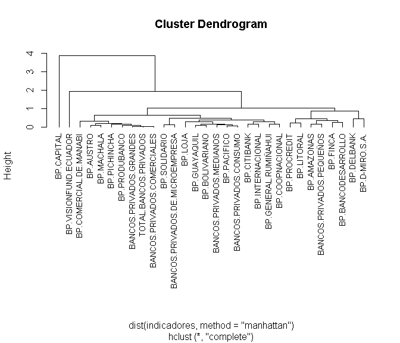<!-- -->

Nuevamente sostenemos que seis clusters son suficientes para clasificar.

``` r
cutree(cluster,k=6)
```

    ##                    BP.GUAYAQUIL                     BP.PACIFICO 
    ##                               1                               1 
    ##                    BP.PICHINCHA                   BP.PRODUBANCO 
    ##                               2                               2 
    ##         BANCOS.PRIVADOS.GRANDES                       BP.AUSTRO 
    ##                               2                               2 
    ##                  BP.BOLIVARIANO                     BP.CITIBANK 
    ##                               1                               1 
    ##            BP.GENERAL.RUMIÑAHUI                BP.INTERNACIONAL 
    ##                               1                               1 
    ##                         BP.LOJA                      BP.MACHALA 
    ##                               1                               2 
    ##                    BP.SOLIDARIO                    BP.PROCREDIT 
    ##                               1                               3 
    ##        BANCOS.PRIVADOS.MEDIANOS                     BP.AMAZONAS 
    ##                               1                               3 
    ##          BP.COMERCIAL.DE.MANABI                      BP.LITORAL 
    ##                               2                               3 
    ##                 BP.COOPNACIONAL                      BP.CAPITAL 
    ##                               1                               4 
    ##                        BP.FINCA                      BP.DELBANK 
    ##                               3                               5 
    ##                  BP.D-MIRO.S.A.              BP.BANCODESARROLLO 
    ##                               5                               3 
    ##           BP.VISIONFUND.ECUADOR        BANCOS.PRIVADOS.PEQUEÑOS 
    ##                               6                               3 
    ##           TOTAL.BANCOS.PRIVADOS     BANCOS.PRIVADOS.COMERCIALES 
    ##                               2                               2 
    ##         BANCOS.PRIVADOS.CONSUMO BANCOS.PRIVADOS.DE.MICROEMPRESA 
    ##                               1                               1

Un análisis cuidadoso de ambos dendogramas nos revela el gran parecido
que tienen ambas clasificaciones. Manteniendose al margen Bank Capital
en un grupo. En el segundo grupo, tenemos el banco visionfund de
Ecuador. En el tercer grupo tenemos en ambos dendogramas, por ejemplo,
el banco de Pichincha, el total de bancos privados, los bancos privados
comerciales, banco del Austro, Machala, entre otros. En el cuarto grupo
tenemos, por ejemplo, los bancos Guayaquil, Loja, Bolivariano, Citibank,
entre otros. En el quinto grupo tenemos los bancos Procredit, Litoral,
Amazonas, Finca, entre otros. En último grupo, ambos dendogramas
presentan BP. DelBank y BP. D-Miro.

# Cluster no jerárquico.

Vamos a clasificar los datos haciendo uso de un cluster no jerarquico.
Aplicaremos el algoritmo de k-medias. Primero buscaremos el número
óptimo de clasificación. Nosotros propondremos 6 como valor óptimo.

``` r
clusteroptimo <- NbClust(indicadores,
                         distance="euclidean",
                         min.nc=2,
                         max.nc=8,
                         method="ward.D",
                         index="all")
```

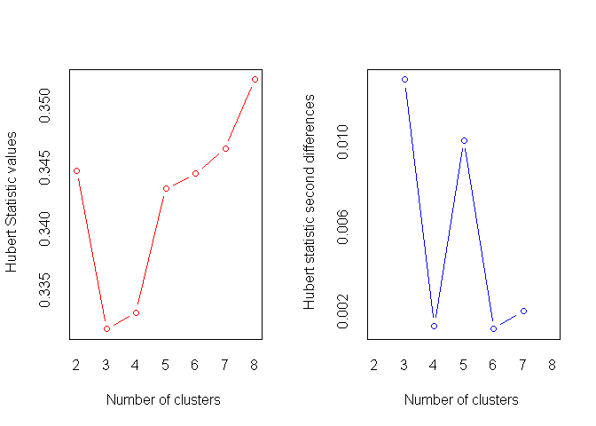<!-- -->

    ## *** : The Hubert index is a graphical method of determining the number of clusters.
    ##                 In the plot of Hubert index, we seek a significant knee that corresponds to a 
    ##                 significant increase of the value of the measure i.e the significant peak in Hubert
    ##                 index second differences plot. 
    ## 

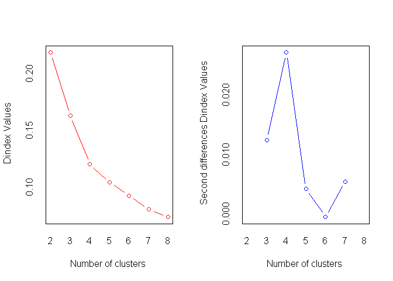<!-- -->

    ## *** : The D index is a graphical method of determining the number of clusters. 
    ##                 In the plot of D index, we seek a significant knee (the significant peak in Dindex
    ##                 second differences plot) that corresponds to a significant increase of the value of
    ##                 the measure. 
    ##  
    ## ******************************************************************* 
    ## * Among all indices:                                                
    ## * 10 proposed 2 as the best number of clusters 
    ## * 1 proposed 3 as the best number of clusters 
    ## * 8 proposed 4 as the best number of clusters 
    ## * 1 proposed 7 as the best number of clusters 
    ## * 4 proposed 8 as the best number of clusters 
    ## 
    ##                    ***** Conclusion *****                            
    ##  
    ## * According to the majority rule, the best number of clusters is  2 
    ##  
    ##  
    ## *******************************************************************

Los métodos de selección proponen dos clusters como la mejor
clasificación. Evaluamos el cluster con dos clasificadores aplicando una
silueta.

``` r
cls2 <- kmeans(indicadores,2)
silueta <- silhouette(cls2$cluster,
                      dist(indicadores,method="euclidean"))

fviz_silhouette(silueta)
```

    ##   cluster size ave.sil.width
    ## 1       1    1          0.00
    ## 2       2   29          0.85

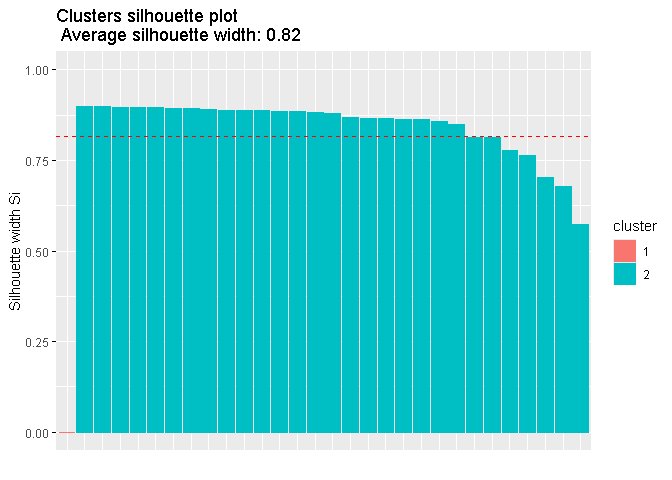<!-- -->

Al parecer el cluster puede mejorarse algo más utilizando otro método,
pero por el momento podemos decir que la casificación es decente. Vamos
a visualizarlo.

``` r
fviz_cluster(cls2,data = indicadores)
```

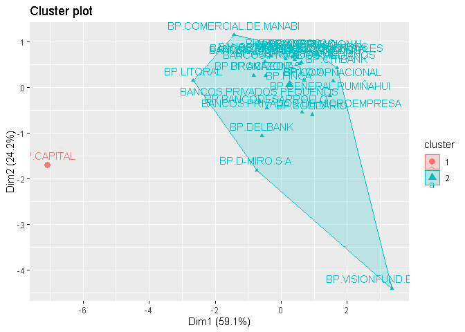<!-- -->

Puede observarse cómo BP.Capital es práctimente un outlier en nuestros
datos. De acuerdo a lo que sabemos de nuestra clusterización jerarquica,
BP.Visionfund Ecuador es un potencial outlier también, puede verse
incluso en este gráfica.Vamos a remover ambos bancos y a reclasificar
para reclasificar.

``` r
ind_bankCap <-  which(indicadores %>% row.names() == "BP.CAPITAL")
ind_bankVisEc <- which(indicadores %>% row.names() == "BP.VISIONFUND.ECUADOR")

indicadores <- indicadores[-c(ind_bankCap,ind_bankVisEc),]
```

Estudiamos el número óptimo de clasificadores. Nosotros consideramos que
deben ser cuatro.

``` r
clusteroptimo <- NbClust(indicadores,
                         distance="euclidean",
                         min.nc=2,
                         max.nc=8,
                         method="ward.D",
                         index="all")
```

    ## Warning in pf(beale, pp, df2): Se han producido NaNs

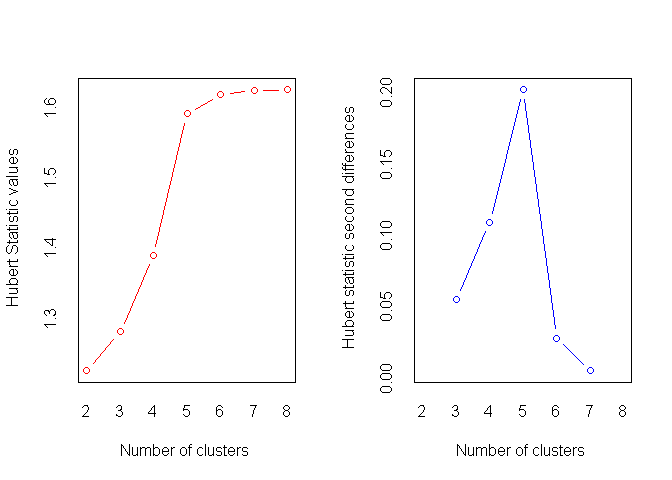<!-- -->

    ## *** : The Hubert index is a graphical method of determining the number of clusters.
    ##                 In the plot of Hubert index, we seek a significant knee that corresponds to a 
    ##                 significant increase of the value of the measure i.e the significant peak in Hubert
    ##                 index second differences plot. 
    ## 

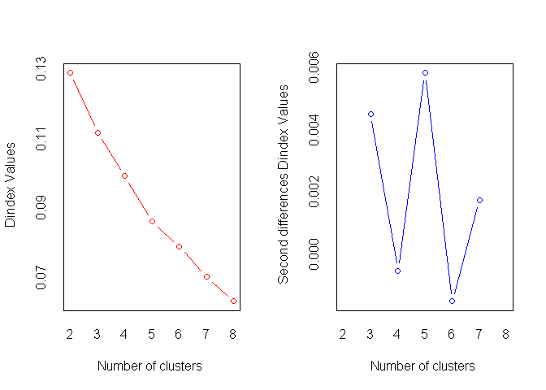<!-- -->

    ## *** : The D index is a graphical method of determining the number of clusters. 
    ##                 In the plot of D index, we seek a significant knee (the significant peak in Dindex
    ##                 second differences plot) that corresponds to a significant increase of the value of
    ##                 the measure. 
    ##  
    ## ******************************************************************* 
    ## * Among all indices:                                                
    ## * 10 proposed 2 as the best number of clusters 
    ## * 4 proposed 3 as the best number of clusters 
    ## * 4 proposed 4 as the best number of clusters 
    ## * 3 proposed 5 as the best number of clusters 
    ## * 1 proposed 7 as the best number of clusters 
    ## * 2 proposed 8 as the best number of clusters 
    ## 
    ##                    ***** Conclusion *****                            
    ##  
    ## * According to the majority rule, the best number of clusters is  2 
    ##  
    ##  
    ## *******************************************************************

Podemos observar como tambien dos clusters son sugeridos.

``` r
cls2 <- kmeans(indicadores,2)
silueta <- silhouette(cls2$cluster,
                      dist(indicadores,method="euclidean"))

fviz_silhouette(silueta)
```

    ##   cluster size ave.sil.width
    ## 1       1    7          0.39
    ## 2       2   21          0.57

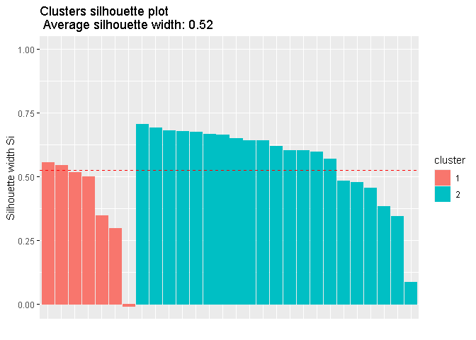<!-- --> El
rendimiento de la clasificación decayo. tenemos incluso una barra en
negativo. Visualicemos el cluster.

``` r
fviz_cluster(cls2,data = indicadores)
```

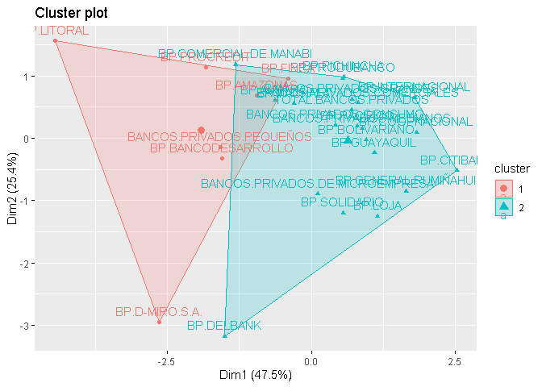<!-- -->
Estudiaremos que tal es una clasificación con cuatro clusters.

``` r
cls4 <- kmeans(indicadores,4)
silueta <- silhouette(cls4$cluster,
                      dist(indicadores,method="euclidean"))

fviz_silhouette(silueta)
```

    ##   cluster size ave.sil.width
    ## 1       1    7          0.01
    ## 2       2    6          0.33
    ## 3       3   11          0.40
    ## 4       4    4          0.40

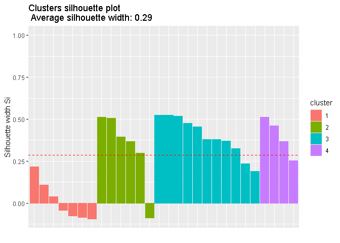<!-- -->

Puede notarse cómo el rendimiento es incluso peor que el anterior. Por
tanto, nos quedaremos con una clasificación de dos clusters a pesar de
no ser tan satisfactoria.
