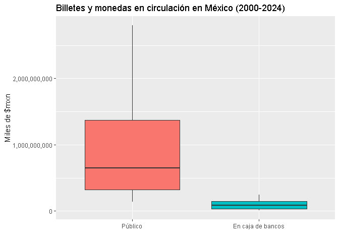

Ejercicio de Fin de Módulo II
================
Jeshua Zyanya Bejarano García
2024-09-26

Llamamos las librerias a utilzar.

``` r
library(openxlsx)
library(ggplot2)
library(reshape2)
library(dplyr)
```

    ## 
    ## Adjuntando el paquete: 'dplyr'

    ## The following objects are masked from 'package:stats':
    ## 
    ##     filter, lag

    ## The following objects are masked from 'package:base':
    ## 
    ##     intersect, setdiff, setequal, union

``` r
library(lubridate)
```

    ## 
    ## Adjuntando el paquete: 'lubridate'

    ## The following objects are masked from 'package:base':
    ## 
    ##     date, intersect, setdiff, union

``` r
library(fpp3)
```

    ## Registered S3 method overwritten by 'tsibble':
    ##   method               from 
    ##   as_tibble.grouped_df dplyr

    ## ── Attaching packages ──────────────────────────────────────────── fpp3 1.0.0 ──

    ## ✔ tibble      3.2.1     ✔ feasts      0.3.2
    ## ✔ tidyr       1.3.1     ✔ fable       0.3.4
    ## ✔ tsibble     1.1.5     ✔ fabletools  0.4.2
    ## ✔ tsibbledata 0.4.1

    ## ── Conflicts ───────────────────────────────────────────────── fpp3_conflicts ──
    ## ✖ lubridate::date()    masks base::date()
    ## ✖ dplyr::filter()      masks stats::filter()
    ## ✖ tsibble::intersect() masks base::intersect()
    ## ✖ tsibble::interval()  masks lubridate::interval()
    ## ✖ dplyr::lag()         masks stats::lag()
    ## ✖ tsibble::setdiff()   masks base::setdiff()
    ## ✖ tsibble::union()     masks base::union()

``` r
library(scales)
library(gganimate)
library(animation)
library(dygraphs)
```

Cargamos nuestras bases de datos.

``` r
BMon_Circ_Dep <- read.xlsx("data/BaseMonetaria_Circulante_Depósito.xlsx",startRow = 18, colNames = T,detectDates=T)
Billetes_Monedas <- read.xlsx("data/BilletesMonedas_en_circulación.xlsx",startRow = 18, colNames = T,detectDates=T)
```

Transformamos nuestros datos para acomodarlos.

``` r
BMon_Circ_Dep <- BMon_Circ_Dep %>% 
  mutate(Fecha = yearmonth(Fecha)) %>%
  group_by(Fecha) %>% 
  summarise(
    "Base monetaria" = sum(SF43695),
    "Billetes y monedas en circulación" = sum(SF43702),
    "Depósitos bancarios en cuenta corriente" = sum(SF43696)
    ) %>% 
  as_tsibble(index=Fecha); head(BMon_Circ_Dep)
```

    ## # A tsibble: 6 x 4 [1M]
    ##       Fecha `Base monetaria` Billetes y monedas en circ…¹ Depósitos bancarios …²
    ##       <mth>            <dbl>                        <dbl>                  <dbl>
    ## 1 2000 ene.         5144235.                     5144030.                   205.
    ## 2 2000 feb.         4412442.                     4410388.                  2053.
    ## 3 2000 mar.         4637202.                     4635860.                  1342.
    ## 4 2000 abr.         4686270                      4684181.                  2089.
    ## 5 2000 may.         4853991.                     4849778.                  4213 
    ## 6 2000 jun.         4788264.                     4786266.                  1997.
    ## # ℹ abbreviated names: ¹​`Billetes y monedas en circulación`,
    ## #   ²​`Depósitos bancarios en cuenta corriente`

``` r
Billetes_Monedas <- Billetes_Monedas %>% 
  mutate(Fecha = yearmonth(Fecha),
         "Billetes y monedas en circulación" = as.numeric(SF1),
         "Público" = as.numeric(SF4),
         "En caja de bancos" = as.numeric(SF5),
         .keep = "none"
         ) %>% 
  as_tsibble(index=Fecha); head(Billetes_Monedas)
```

    ## Warning: There were 2 warnings in `mutate()`.
    ## The first warning was:
    ## ℹ In argument: `Público = as.numeric(SF4)`.
    ## Caused by warning:
    ## ! NAs introducidos por coerción
    ## ℹ Run `dplyr::last_dplyr_warnings()` to see the 1 remaining warning.

    ## # A tsibble: 6 x 4 [1M]
    ##       Fecha `Billetes y monedas en circulación`   Público `En caja de bancos`
    ##       <mth>                               <dbl>     <dbl>               <dbl>
    ## 1 2000 ene.                           157161287 143167025            13994262
    ## 2 2000 feb.                           150126022 137215576            12910446
    ## 3 2000 mar.                           152919896 139170523            13749373
    ## 4 2000 abr.                           158846323 142944404            15901919
    ## 5 2000 may.                           157679406 142796337            14883069
    ## 6 2000 jun.                           165529481 150447174            15082307

Graficamos un par de Boxplots de los billetes y monedas en circulación
al público mexicano y en cajas.

``` r
Billetes_Monedas %>% melt(id.vars = "Fecha") %>% 
  filter(variable=="Público" | variable=="En caja de bancos") %>% 
  ggplot(aes(x=variable,y=value,fill=variable)) +
  geom_boxplot() +
  labs(title="Billetes y monedas en circulación en México (2000-2024)",
       x="",
       y="Miles de $mxn")+
  scale_y_continuous(labels=label_comma()) +
  theme(legend.position = "none")
```

    ## Warning: Removed 2 rows containing non-finite outside the scale range
    ## (`stat_boxplot()`).

<!-- -->
Construímos dos gráficos de barras para las mismas variables a lo largo
del tiempo.

``` r
Billetes_Monedas %>% melt(id.vars = "Fecha") %>%
  filter(variable=="Público" | variable=="En caja de bancos") %>% 
  ggplot(aes(x=Fecha,y=value)) +
  geom_bar(position = "dodge",stat="identity") + 
  facet_grid(variable~.,scales="free") + 
  labs(title="Billetes y monedas en circulación en México",
       subtitle="2000-2024",
       x="",
       y="Miles de $mxn") +
  scale_y_continuous(labels=label_comma())
```

    ## Warning: Removed 2 rows containing missing values or values outside the scale range
    ## (`geom_bar()`).

<!-- -->

Graficamos la base monetaria mexicana: los billetes y monedas en
circulación y los depósito bancarios en cuenta corriente.

``` r
BMon_Circ_Dep %>% melt(id.vars = "Fecha") %>%
  filter(variable!="Base monetaria") %>% 
  ggplot(aes(x=Fecha,y=value)) +
  geom_line() + 
  facet_grid(variable~.,scales="free") + 
  labs(title="Base monetaria en México",
       subtitle="2000-2024",
       x="",
       y="Millones de $mxn")+
  geom_smooth(method="loess") + 
  scale_y_continuous(labels=label_comma())
```

    ## `geom_smooth()` using formula = 'y ~ x'

<!-- -->

Graficamos lo de arriba sin la tendencia y con animación.

``` r
BMon_Circ_Dep %>% melt(id.vars = "Fecha") %>%
  filter(variable!="Base monetaria") %>% 
  ggplot(aes(x=as.Date(Fecha),y=value)) +
  geom_line() + 
  facet_grid(variable~.,scales="free") + 
  labs(title="Base monetaria en México",
       subtitle="2000-2024",
       x="",
       y="Millones de $mxn") +
  scale_y_continuous(labels=label_comma()) +
  transition_reveal(along=as.Date(Fecha))
```

<!-- -->
