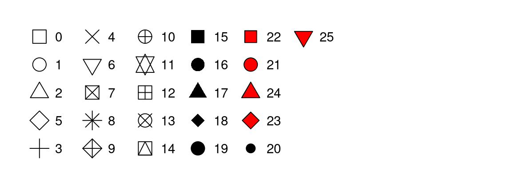

## R for Data Science, [Layers](https://r4ds.hadley.nz/layers).

If the graph we want can not be made by the usual ggplot geoms, visit [this site]( https://exts.ggplot2.tidyverse.org/gallery/)

A comprensive overview for all geoms in [this site]( https://ggplot2.tidyverse.org/reference.)

Calling libraries.
```{r}
library(tidyverse)
library(ggridges)
```
It is important observe the ways we graph the simbols and the shape we give them.


R has 26 built-in shapes that are identified by numbers. There are some seeming duplicates: for example, 0, 15, and 22 are all squares. The difference comes from the interaction of the color and fill aesthetics. The hollow shapes (0–14) have a border determined by color; the solid shapes (15–20) are filled with color; the filled shapes (21–25) have a border of color and are filled with fill. Shapes are arranged to keep similar shapes next to each other.


9.2.1. Create a scatterplot of hwy vs. displ where the points are pink filled in triangles.
```{r}
ggplot(mpg,mapping=aes(x=displ,y=hwy))+
geom_point(color="pink",shape=17)
```

9.2.2. Why did the following code not result in a plot with blue points?
```{r}
ggplot(mpg) + 
  geom_point(aes(x = displ, y = hwy, color = "blue"))
```
because it's inside aesthetic function, we know it result in coloring the classes which the points where divided. The next code solve the problem
```{r}
ggplot(mpg) + 
  geom_point(color = "blue",aes(x = displ, y = hwy))
```
9.2.3. What does the stroke aesthetic do? What shapes does it work with? (Hint: use ?geom_point)
```{r}
?geom_point
# Code from the helper
ggplot(mtcars, aes(wt, mpg)) +
  geom_point(shape = 21, colour = "black", fill = "white", size = 5, stroke = 5)
```
stroke is the atributte for the size of frontiers of the shapes.

9.2.4. What happens if you map an aesthetic to something other than a variable name, like aes(color = displ < 5)? Note, you’ll also need to specify x and y.
```{r}
ggplot(mpg,mapping=aes(x=displ,y=hwy,color=displ<5)) +
geom_point()
```

9.3.2 Earlier in this chapter we used show.legend without explaining it:
```{r}
ggplot(mpg, aes(x = displ, y = hwy)) +
  geom_smooth(aes(color = drv), show.legend = FALSE)
```
What does show.legend = FALSE do here? What happens if you remove it? Why do you think we used it earlier?

3. What does the se argument to geom_smooth() do?
```{r}
ggplot(mpg, aes(x = displ, y = hwy)) +
  geom_smooth(se=F ,aes(color = drv), show.legend = FALSE)
```
4. Recreate the R code necessary to generate the following graphs. Note that wherever a categorical variable is used in the plot, it’s drv.
```{r}
ggplot(mpg,aes(x=displ,y=hwy)) + 
  geom_point()+
  geom_smooth(se=F,color="blue")
```
```{r}
ggplot(mpg,aes(x=displ,y=hwy)) + 
  geom_point()+
  geom_smooth(aes(group=drv),se=F,color="blue")
```
```{r}
ggplot(mpg,aes(x=displ,y=hwy,color=drv)) + 
  geom_point()+
  geom_smooth(aes(group=drv,color=drv),se=F) # Se puede quitar el group y el color.
```
```{r}
ggplot(mpg,aes(x=displ,y=hwy)) + 
  geom_point(aes(color=drv))+
  geom_smooth(se=F)
```
```{r}
ggplot(mpg,aes(x=displ,y=hwy)) + 
  geom_point(aes(color=drv))+
  geom_smooth(aes(linetype=drv),se=F)
```
```{r}
ggplot(mpg, aes(x=displ,y=hwy, color=drv))+
  geom_point()+
  geom_point(size=2,shape=1,stroke=2,color="white")
```

